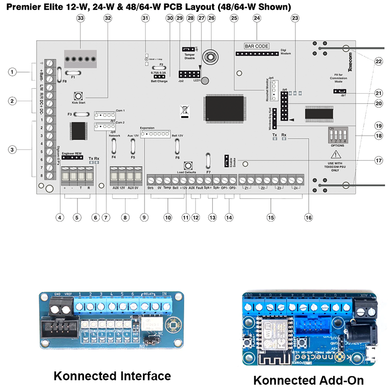

# Texecom, Konnected and Home Assistant

For some time I've been running the excellent [texecom2mqtt](https://github.com/dchesterton/texecom2mqtt-hassio) add-on for Home Assistant. But this requires the use of a ComIP, ComWiFi or SmartCom for access to the alarm panel. Because of panel placement the use of a ComWiFi has proved to be less than ideal, with the WiFi board regularly losing connectivity or failing and needing a reboot. Also, I think the texecom2mqtt add-on fairly regularly receives invalid information from the alarm panel, fails and needs to be restarted.

I'm looking for something reliable, so have converted over to a Konnected.io [Alarm Panel Interface Kit](https://konnected.io/collections/shop-now/products/konnected-alarm-panel-interface-kit). This was relatively easy to set up, there are some excellent videos available on the internet by Nate the founder of Konnected, but there are some adjustments that need to be made.

## Current Setup
For my set-up, I'm using a Texecom Premier Elite 12-W. This has a number of pre-configured zones using the house alarm wiring, plus some Ricochet devices which use a dedicated Texecom mesh network to communicate.

For this setup, I wanted to retain the existing alarm functionality, but add on the ability to manage from HA, which is why I went for the interface kit, rather the conversion kit which would have replaced the existing panel but not been able to utilise the existing ricochet devices. 

## Baseline
For the purposes of this write I'll talk to the 48-W (since that is what I have an image for) and the Interface kit with the base 6 zones.

## Konnected Kit
The kit comes with everything you need, and can be used to support zones in multiples of 6:
* Interface Module
* Add-on Board
* Jumper wires (male-male, male-female)
* Power supply (though you can power from the aux ports of the Texecom Alarm panel)
* DC power pigtail (to connect to aux power)
* Ribbon cable (for linking the two boards)
* Adhesive-backed Mounting Standoffs

You get more for less money if you buy it from the US, but delivery is longer and I didn't want to wait.

## Setup
### Video
This video gives an excellent guide to basic setup enabling zone monitoring, alarm state and enabling/disabling alarm. [Konnected Alarm Panel Interface v2 1 install video w/ Ademco VISTA series alarm system & SmartThings](https://youtu.be/-zOMsLEMQgg). I ignored the Smarthings pieces, I'll go into the HA bits in this write-up.

### Boards
The below shows the boards without any wiring in place. I'll describe that and show a final picture at the bottom.


### Wiring
#### Interface - Voltage Reference Wiring
The aux power at item 8 can be used. Aux 0V to GND, Aux 12V to VREF.

#### Interface - Zone wiring
The zones are at item 15. Wire to the zones (1-6) on the Interface board. *Potentiometer On*

When you trigger the zone, the relevant light should go out.

You need to make sure to connect to the correct port in each zone. My alarm zones were wired with a black wire to the left connector and a red wire to the right connector. A multi-meter showed that this was then pulled to -12V when a door was opened, so clearly the left connector was the high connector. I haven't tried it, but the video linked shows setting the potentiometer just on, I think if I left my zones connected to the right connector, I would have needed to have the potentiometer just off.

#### Interface - Programmable Outputs
You can use either the Digicom Outputs at item 3, or the Panels Outputs at item 14. Wire to the zones (1-6) on the Interface board. *Potentiometer Off* (when unprogrammed)

When you trigger the programmed item, the light should go out.

These outputs by default get pulled low when triggered, so are at 0V when unprogrammed, So for these when they are not configured on the panel, they need the potentiometer to be just off. The video indicates they should be just on, but I found this to be incorrect. In any case, you can invert this when programming the panel.

You can actually programme them to trigger on or off, and then just respond appropriately in Home Assistant, it's really up to you. I decided I would have all the lights on the interface board be in an On state when nothing was triggered and the Keyswitch was off.

#### Interface - Keyswitch
Connect the interface Relay to a spare zone at item 15. Polarity is not important. Also connect IN connector to Add-On OUT connector.

To be honest I forget which way I set the potentiometer, I think it was just on. But I made sure it changed when the keyswitch changed. I'm not sure if that is important, the video says it just an open/close circuit.

I left the jumper on the interface at Normally Open and configured the Texecom panel accordingly.

#### Add-On - Power
The aux power at item 8 can be used. Aux 0V to AUX -, Aux 12V to AUX +.

You can also use the supplied power supply, or use the pigtail connecting the red and black wires to the item 8 aux ports and then plugging into the 12V DC power port.

#### Add-On - Keyswitch
As above, connect OUT connector to Interface IN connector.

### Full Wiring


### Texecom Programming
I did this all in Wintex, you can configure them on the board, but Wintex is just easier. Any sections of each page that I didn't configure I haven't mention below. Don't forget to read from the board before you make a change and send back (the current page) after you make the change.
#### Wired Zones
Really nothing to do here, as long as you have wired correctly and set the potentiometers correctly, they should work.

#### Outputs
On the Outputs page of Wintex, pick one of the Digi Outputs (1-8) for each item.
* Ricochet Zone
  * Group Type - Zone
  * Zone No - Ricochet Zone (found from Zones page)
  * Output Function - Mimic. This will trigger the output when the alarm is both unarmed and armed.
  * Attributes - Inverted (to invert the negative polarity of the output)
* Armed State
  * Group Type - Area
  * Areas - A or B or both as appropriate
  * Output Function - Armed/Full Armed/Part Armed as appropriate
  * Attributes - Inverted
* Alarm
  * Group Type - Area
  * Areas - A or B or both as appropriate
  * Output Function - Alarm (not actually tested this yet)
  * Attributes - Inverted

I wired to the Digicom Outputs, but you can use Panel Outputs, all are programmed the same. You can configure complex items by using Custom Outputs and then assigning the Custom Output result to the relevant Digi/Panel Output. I kept it simple for the moment.

#### Keyswitch Zone
On the Zones page of Wintex, pick an available Zone.
* Zone Type - Latch Key
* Areas - A or B or both as appropriate
* Attributes - Configure options as appropriate
* Zone Wiring - Normally Open

### WiFi Connection
Instructions for connecting to WiFi can be found on the [Konnected website](https://help.konnected.io/support/solutions/articles/32000022408-connecting-to-your-network)

### Home Assistant
#### Integration Configuration
Install the Konnected.io integration. It's possible your HA instance has already discovered it. More details can be found in the [Home Assistant Docs](https://www.home-assistant.io/integrations/konnected/). The configuration shown below made the HA icons look right in my eyes. You may have a different view, so configure as you like.

After initial configuration, you then need to configure the zones and switch components using the CONFIGURE link on the Integrations card in HA.
* Zones - Probably `Binary Sensor` but other options are available as appropriate
* Out - This is your keyswitch which should be set to `Switchable Output`

After clicking SUBMIT, you are presented with a page for each Zone and the Switch where you can set various options.
* Wired Zones
  * Binary Sensor Type - as appropriate
  * Name - as appropriate
  * Inverted - unset
* Ricochet Zones
  * Binary Sensor Type - as appropriate
  * Name - as appropriate
  * Inverted - unset
* Armed State
  * Binary Sensor Type - lock
  * Name - as appropriate
  * Inverted - set
* Alarm
  * Binary Sensor Type - safety
  * Name - as appropriate
  * Inverted - unset
* Keyswitch/OUT
  * Name - as appropriate
  * Output when on - high
  * Pulse duration - Blank
  * Pause between pulses - Blank
  * Times to repeat - Blank
  * Configure additional states for this zone - No
* Configure Misc - See integration docs and configure as you would like. I didn't need to change anything.

#### Alarm Control Panel
The final thing I did was set up a template [Alarm Control Panel](https://www.home-assistant.io/integrations/alarm_control_panel.template/).

Very basic set up as below:
```yaml
alarm_control_panel:
  - platform: template
    panels:
      texecom:
        name: Texecom
        unique_id: texecom
        value_template: >
          
            triggered
          
            armed_away
          
            armed_home
          
            disarmed
          
        arm_away:
          service: switch.turn_on
          target:
            entity_id: switch.texecom_full_arm
          data:
            code: !secret alarm_code
        arm_home:
          service: switch.turn_on
          target:
            entity_id: switch.texecom_part_arm
          data:
            code: !secret alarm_code
        disarm:
          - service: switch.turn_off
            target:
              entity_id: 
                - switch.texecom_part_arm
                - switch.texecom_full_arm
            data:
                code: !secret alarm_code
```

